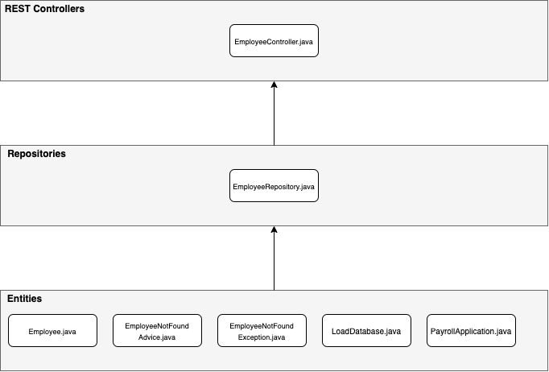

# IES - LAB03
#### Author: Francisca Barros, NMEC-93102
---
 
## 3.1 - Layered Applications in Spring
*the following extension was installed, in order to build Spring Boot Applications within VSCode*
[Spring Boot Extension Pack](https://marketplace.visualstudio.com/items?itemName=Pivotal.vscode-boot-dev-pack)
[Tutorial Example Explored](https://spring.io/guides/tutorials/rest/)

**Representational State Transfer (REST)** is an *architectural style* that specifies constraints (eg. uniform interface); applied to a web service induce desirable properties (performance, scalability, modifiability), which enable services to work best on the Web; clients and servers exchange representations of resources via a standardized interface and protocol (usually HTTP).
*RESTful applications are simple, lightweight and fast*


##### a)  

Like stated in the tutorial followed,
> REST embraces the precepts of the web (architecture, benefits, and everything else)
> What *benefits*? The web and its core protocol, HTTP, provide a stack of features:
> - Suitable actions (GET, POST, PUT, DELETE, …​)
> - Caching
> - Redirection and forwarding
> - Security (encryption and authentication)
> **Critical factors** on building **resilient services**. 
> So *building on top of HTTP*, REST APIs provide the means to build flexible APIs that can:
> - Support backward compatibility
> - Evolvable APIs
> - Scaleable services
> - Securable services
> - A spectrum of stateless to stateful services
> However ubiquitous, it's not a standard, but an approach, a style, a set of constraints on your architecture that can help you build web-scale systems.


##### b)
**PUT Requests** are used to update existing entries
```zsh
~ % curl -X PUT -H "Content-Type: application/json" -d '{"id": 1, "name": "Francisca", "role": "Student"}' "http://localhost:8080/employees/1"
{"id":1,"name":"Francisca","role":"Student"}
```
**GET Requests** are used to retrieve existing entries
```zsh
~ % curl -i -H "Accept: application/json" -H "Content-Type: application/json" -X GET http://localhost:8080/employees/1
HTTP/1.1 200
Content-Type: application/json
Transfer-Encoding: chunked
Date: Tue, 03 Nov 2020 10:47:19 GMT
{"id":1,"name":"Francisca","role":"Student","_links":{"self":{"href":"http://localhost:8080/employees/1"},"employees":{"href":"http://localhost:8080/employees"}}}
```
**POST Requests** are used to insert new entries
```zsh
~ % curl -H "Accept: application/json" -H "Content-Type: application/json" -X POST -d '{"name":"Employee2","role":"Another Employee"}' http://localhost:8080/employees
{"id":3,"name":"Employee2","role":"Another Employee"}
```
**DELETE Requests** are used to delete entries
```zsh
~ % curl -H "Accept: application/json" -H "Content-Type: application/json" -X DELETE http://localhost:8080/employees/3
3
(...)
~ % curl -i -H "Accept: application/json" -H "Content-Type: application/json" -X GET http://localhost:8080/employees/3
HTTP/1.1 404
Content-Type: application/json
Content-Length: 25
Date: Tue, 03 Nov 2020 11:00:42 GMT

Could not find employee 3
```

##### c)
When the application is stopped and restarted, all the data manipulated before (inserted, updated, deleted) is lost, and we return to square 1 (we get our application just like the first time we started it).
Since we don't actually have a DataBase, but an in-memory non-persistant DataBase that is coupled to the REST instance, our data isn't actually stored in disk (for instance), so it gets deleted. 
We always get the data of two employees due to the method in *LoadDatabase.java*, which inserts them every time our REST API is started.
A possible solution to this problem would be, everytime we make a change in our application, we would write them down on a File (maybe an append-log for speed purposes). That way, when stopping+restarting the REST, we could read from the File and insert that data.

```zsh
curl -i -H "Accept: application/json" -H "Content-Type: application/json" -X GET http://localhost:8080/employees/987987
HTTP/1.1 404
Content-Type: application/json
Content-Length: 30
Date: Tue, 03 Nov 2020 11:05:24 GMT

Could not find employee 987987
```

**Layered architecture view (UML diagram)**

**Employee Controller** -> manipulation of data; maps the link between HTTP Requests and Repository methods that handle the requests
**Employee Repository** -> has the neccessary methods to support working with a data-store (in this case, JPA Repository; we can create, read, update and delete records)
**Employee** -> represents an employee (a record in our data-store)
**EmployeeNotFoundAdvice** -> When someone tries to use a record that doesn't exist, a page is displayed with some advice
**EmployeeNotFoundException** -> When someone tries to use a record that doesn't exist, exception is thrown
**LoadDatabase** -> In our case, it automatically creates two records and inserts them in our Repostiory
**PayrollApplication** -> The application itself; it does all the binding needed (with the @SpringBootApplication annotation)

---
#
## 3.2 - Accessing JPA Data with REST interface
[Introduction to the Java Persistence API](https://docs.oracle.com/javaee/6/tutorial/doc/bnbpz.html)
The **Java Persistence API** provides an object/relational mapping facility for managing relational data in Java applications; most of the work is provided by the *adaption layer* (implements JPA specification and converts objects into relational data and vice-versa)
It defines a set of concepts that can be implemented by any tool/framework (like Hibernate framework), Spring Data uses and enhances the JPA.
When using JPA, Java code is *independent from the specific database implementation*

#### d)
An instance of MySQL Server is needed. That can be done with a *Docker Container*
```zsh
$ docker run --name mysql5 -e MYSQL_ROOT_PASSWORD=password -e MYSQL_DATABASE=demo -e MYSQL_USER=demo -e MYSQL_PASSWORD=password -p 3306:3306 -d mysql/mysql- server:5.7
```

#### i)
[Accessing Data with MySQL](https://spring.io/guides/gs/accessing-data-mysql/)

```zsh
curl -H "Accept: application/json" -H "Content-Type: application/json" -X POST -d '{"firstName":"John","lastName":"Doe", "emailId":"johndoe@gmail.com"}' http://localhost:8080/api/v1/employees
{"id":1,"firstName":"John","lastName":"Doe","emailId":"johndoe@gmail.com"}
```
```zsh
curl -i -H "Accept: application/json" -H "Content-Type: application/json" -X GET http://localhost:8080/api/v1/employees
HTTP/1.1 200
Content-Type: application/json
Transfer-Encoding: chunked
Date: Tue, 03 Nov 2020 14:23:42 GMT

[{"id":1,"firstName":"John","lastName":"Doe","emailId":"johndoe@gmail.com"}]
```

#### j)
```zsh
~ % curl -i -H "Accept: application/json" -H "Content-Type: application/json" -X GET http://localhost:8080/api/v1/employees\?email\=johndoe@gmail.com
HTTP/1.1 200
Content-Type: application/json
Transfer-Encoding: chunked
Date: Tue, 03 Nov 2020 14:27:57 GMT

[{"id":1,"firstName":"John","lastName":"Doe","emailId":"johndoe@gmail.com"}]
```

[Table](https://docs.oracle.com/javaee/5/api/javax/persistence/Table.html)
[Column](https://docs.oracle.com/javaee/5/api/javax/persistence/Column.html)
[Id](https://docs.oracle.com/javaee/5/api/javax/persistence/Id.html)
**@Table** -> *This annotation specifies the primary table for the annotated entity. Additional tables may be specified using SecondaryTable or SecondaryTables annotation.If no Table annotation is specified for an entity class, the default values apply.* 
**@Column** -> *Is used to specify a mapped column for a persistent property or field. If no Column annotation is specified, the default values are applied.*
**@Id** -> *Specifies the primary key property or field of an entity.*

[Guide to Spring @AutoWired](https://www.baeldung.com/spring-autowire)
**@AutoWired** -> It allows Spring to resolve and inject collaborating beans into our bean; by declaring all the bean dependencies in a Spring configuration file, Spring container can autowire relationships between collaborating beans. Spring Boot application will automatically scan the components in the current package and its sub-packages. 
#TL;DR It basically spares you the need to do the wiring (eg XML file), it finds what needs to be injected where, and does that for you.
In this example, this annotation is used to tag the EmployeeRepository (no need to provide getters and setters by ourselves)


---
#
## 3.3 - From data to presentation (Thymeleaf)

#### k)
**Spring Data JPA** -> makes it easy to easily implement JPA based repositories; deals with enhanced support for JPA based data access layers; makes it easier to build Spring-powered applications that use data access technologies.
**H2 Database** -> relational database management system written in Java; can be embedded in Java applications or run in client-server mode.
**Thymeleaf** ->  modern server-side Java template engine for both web and standalone environments; main goal: bring elegant natural templates to your development workflow — HTML that can be correctly displayed in browsers and also work as static prototypes, allowing for stronger collaboration in development teams.
**DevTools** -> automatically recompiles and redeploys the app upon saving and provide additional development experience enhancements


#### l)
This class contains the methods responsible for handling incoming web requests.
> The *@GetMapping annotation* on the method defines that the method handles GET requests.
> The *@PostMapping annotation* signals that this method handles POST requests; called when a POST request is received.
> The *getReport() method* will return the base form template in which the user can submit the issue they found (issues/issuereport_form)
> The *submitReport() method* is responsible for handling the user input after submitting the form. When the data is received and handled (e.g. added to the database), this method returns the same issuereport template (issues/issuereport_form)
> The *getIssues() method* will handle the HTML template for a list view in which all the requests can be viewed (issues/issurereport_list) - Template with a list of all reports that were submitted.

#### m)
This data class represents an issue report by a user. Some of the values are entered by the user, others generated by the system.
> The *@Entity annotation* tells our JPA provider Hibernate that this class should be mapped to the database.
> The database table name is set with the *@Table(name = "issues") annotation*. Explicitly setting the table name avoids the possibility of accidently breaking the database mapping by renaming the class later on.


#### n)
**issuereport_form.html** will be used on the */issuereport route.*
**issuereport_list.html** will be used on the */issues route.*
In our **IssueController.java** to make the correct binding of the objects to the templates, Spring has a Model object which can be passed into the controller.
It is configured via the *addAttribute(key, value) method* (key-where the value can be accessed).

Now, in our **issuereport_form.html** we want to use the IssueReport object which Spring passed.
*<form method="post" th:action="@{/issuereport}" th:object="${issuereport}">*
> *th:action* defines the action that should happen upon submission of the form.


#### o)
This class, **IssueRepository.java** will interface with the db.
By default, it provides the functionality to: fetch all the entries from the database; add new entries; all basic CRUD operations.
> To fetch all entries which are *not marked private*, we add a method using a custom query.
> To fetch all IssueReport objects *reported by the same email-address*, we create a custom method; this does not require a custom @Query string.

In *IssueController.java*, we add a new field of the repository interface; IssueRepository will automatically be injected into the constructor.
The method *save() from the IssueRepository* save a record to the database.


#### p)
*Docker container with an instance of MySQL server (from previous exercise)*
```zsh
$ docker run --name mysql5 -e MYSQL_ROOT_PASSWORD=password -e MYSQL_DATABASE=demo -e MYSQL_USER=demo -e MYSQL_PASSWORD=password -p 3306:3306 -d mysql/mysql- server:5.7
```

In order to be able to use our MySQL database, we must add this dependency into our *pom.xml* file
```xml
<dependency>
    <groupId>mysql</groupId>
	<artifactId>mysql-connector-java</artifactId>
	<scope>runtime</scope>
</dependency>
```

Likewise, we must also change *application.properties*
```
## MySQL
spring.datasource.url = jdbc:mysql://localhost:3306/issuereportdemo
spring.datasource.username = demo
spring.datasource.password = password

#hibernate_sequence doesn't exist
spring.jpa.hibernate.use-new-id-generator-mappings = false

spring.jpa.hibernate.ddl-auto = update
```
